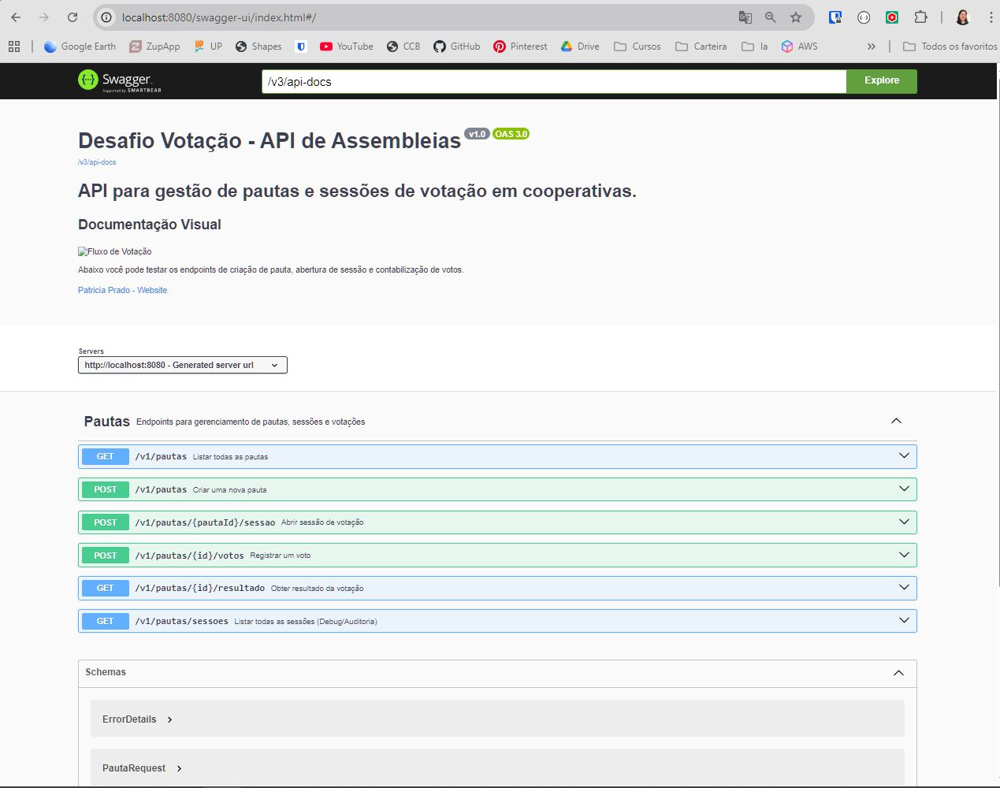

# 🗳️ Desafio Técnico: Sistema de Votação (DBServer)

Este repositório contém uma solução robusta e escalável para o gerenciamento de sessões de votação em assembleias cooperativas, desenvolvida como parte do desafio técnico da DBServer.

## 🏗️ Arquitetura e Decisões Técnicas
A aplicação foi construída utilizando **Arquitetura Hexagonal (Ports and Adapters)**. Esta escolha estratégica visa:
* **Independência de Framework:** O "Core" da aplicação (Regras de Negócio) é isolado de detalhes de infraestrutura.
* **Domínio Rico:** As regras de validação de votos e sessões estão centralizadas no domínio, seguindo os princípios **SOLID**.
* **Testabilidade:** A separação clara permite testes unitários de alta performance e mocks precisos com Mockito.

## 🎨 Protótipo e Design de API (Google Stitch)
Antes da implementação, a solução foi desenhada utilizando o **Google Stitch**, focando na **Experiência do Desenvolvedor (DX)** e na clareza dos fluxos de dados.

| 1. Cadastro de Pauta | 2. Votação | 3. Resultado Final |
|---|---|---|
|  |  |  |
* **Nota sobre DX:** O design foi prototipado para garantir que os contratos REST fossem intuitivos, facilitando o consumo por qualquer front-end ou dispositivo mobile.

## 📖 Documentação da API (Swagger)
A API utiliza o **SpringDoc OpenAPI 3** para gerar documentação interativa.
* **Acesse aqui:** [http://localhost:8080/swagger-ui.html](http://localhost:8080/swagger-ui.html)
* **Destaque:** Interface personalizada com descrições de operações (`@Operation`) e modelos de erro (`ErrorDetails`) detalhados.



---

## 📖 Endpoints Principais (Base URL: `/v1`)

| Recurso | Método | Endpoint | Descrição |
| :--- | :--- | :--- | :--- |
| **Pautas** | `POST` | `/pautas` | Criar uma nova pauta |
| **Pautas** | `GET` | `/pautas` | Listar todas as pautas |
| **Sessões** | `POST` | `/pautas/{id}/sessao` | Abrir votação para uma pauta |
| **Votos** | `POST` | `/pautas/{id}/votos` | Registrar um voto (Valida duplicidade e CPF) |
| **Resultado** | `GET` | `/pautas/{id}/resultado` | Contabilização final dos votos |
| **Auditoria** | `GET` | `/pautas/sessoes` | Status das sessões (Debug/Auditoria) |

## 🧪 Estratégia de Testes e Resiliência
O projeto foca em três pilares de validação:
* **Testes Unitários:** Cobertura de regras de negócio, garantindo que o `votoRepository` identifique duplicidade e lance `VotoDuplicadoException`.
* **Tratamento de Erros:** Mapeamento de exceções para retornos HTTP semânticos (ex: `409 Conflict` para votos duplicados).
* **Seed Dinâmico:** Mecanismo que popula automaticamente 100 votos ao abrir uma sessão para validar performance e algoritmos de soma.

## 🛠️ Tecnologias Utilizadas
* **Linguagem:** Java 21 + Spring Boot 3.
* **Persistência:** PostgreSQL (Produção) e H2 (Testes).
* **Migrations:** Flyway para versionamento de schema.
* **Monitoramento:** Spring Boot Actuator (Health Checks e Métricas).
* **Containers:** Docker & Docker Compose.

## 🐳 Gerenciamento do Ambiente (Docker)
1. **Subir o ambiente:** `docker-compose up -d`
2. **Consultar Logs:** `docker logs -f votacao-api`
3. **Encerrar o ambiente:** `docker-compose down`


## 📊 Observabilidade (Spring Boot Actuator)

A aplicação utiliza o **Spring Boot Actuator** para expor endpoints de monitoramento, permitindo validar a saúde do sistema e métricas de performance.

### 1. Saúde do Sistema (Health Check)
Verifica se a aplicação e seus componentes (como o Banco de Dados PostgreSQL) estão operacionais.
* **Endpoint:** [http://localhost:8080/actuator/health](http://localhost:8080/actuator/health)
* **O que observar:** O status deve retornar `"status": "UP"`.

### 2. Métricas da Aplicação (Metrics)
Exibe uma lista de métricas disponíveis (memória JVM, conexões com banco, threads, etc).
* **Endpoint:** [http://localhost:8080/actuator/metrics](http://localhost:8080/actuator/metrics)
* **Dica:** Para visualizar uma métrica específica, use o caminho completo, ex: `/actuator/metrics/jvm.memory.used`.

---

## ⚙️ Configuração do Ambiente do Banco (Variáveis)

A aplicação está configurada para conectar-se ao PostgreSQL via Docker. Caso deseje rodar localmente fora do container, estas são as configurações de conectividade:

| Variável | Valor Padrão (Docker) | Descrição |
| :--- | :--- | :--- |
| **DB_URL** | `jdbc:postgresql://db:5432/db_votacao` | String de conexão com o Postgres |
| **DB_USERNAME** | `admin` | Usuário do banco de dados |
| **DB_PASSWORD** | `admin` | Senha do banco de dados |

> **Nota de Sênior:** Em um cenário de produção real, estas credenciais seriam injetadas via **AWS Secrets Manager**, garantindo que dados sensíveis não fiquem expostos no código.

---

## 🚀 Como Executar o Projeto

1.  **Pré-requisitos:** Certifique-se de ter o **JDK 21** instalado.
2.  **Clone o repositório:**
    ```bash
    git clone [https://github.com/patcprado/desafio-votacao.git](https://github.com/patcprado/desafio-votacao.git)
    ```
3.  **Execute via Terminal:**
    ```bash
    ./mvnw spring-boot:run
    ```
---

## 🧪 Estratégia de Testes e Resiliência
O projeto foca em três pilares de validação para garantir a integridade e performance:

* **Testes Unitários:** Cobertura de regras de negócio, garantindo que o `votoRepository` identifique duplicidade e lance `VotoDuplicadoException` (Retorno `409 Conflict`).
* **Seed Dinâmico (Carga Automática):** Ao abrir uma sessão, o sistema popula automaticamente **100 votos iniciais**. Isso permite validar instantaneamente os algoritmos de contabilização sem 100 chamadas manuais.
* **Teste de Stress (Concorrência):** O repositório inclui o `teste_stress.sh`, que automatiza a criação de pauta e injeta **50 votos simultâneos** via script para validar o suporte a múltiplas requisições.

---

## ☁️ Estratégia de Cloud (Próximos Passos)

Embora o foco deste desafio seja a lógica de negócio e a API, a solução foi desenhada para ser **Cloud Native**. Em um cenário real de produção, a infraestrutura recomendada seria:

1.  **Containerização:** O `Dockerfile` já presente permite o deploy em clusters **AWS ECS** ou **EKS (Kubernetes)**.
2.  **Escalabilidade:** Utilização de um **Application Load Balancer (ALB)** para distribuir a carga entre múltiplas instâncias da API.
3.  **Persistência Gerenciada:** Migração do banco PostgreSQL local para um **Amazon RDS**, garantindo backups e alta disponibilidade.
4.  **Infraestrutura como Código:** Utilização de **Terraform** para provisionar VPC, Subnets e Security Groups, garantindo um ambiente isolado e seguro.
5.  **Monitoramento:** Integração dos logs via **CloudWatch** e métricas via **Prometheus/Grafana** (utilizando os dados já expostos pelo Spring Actuator).
## 📝 Autor
**Patricia Campos** - Senior Back-end Developer